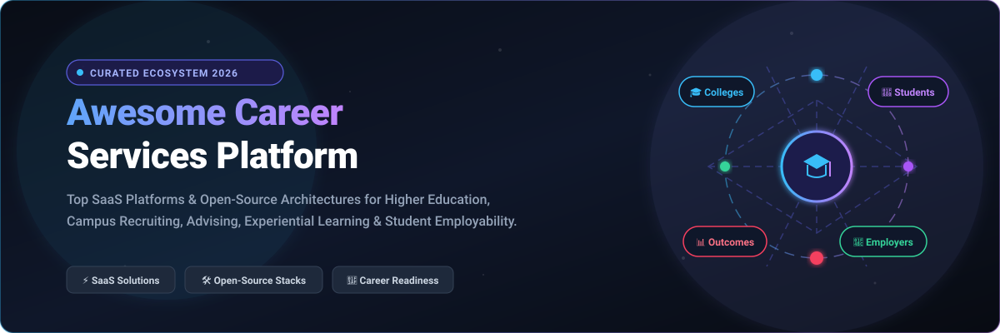
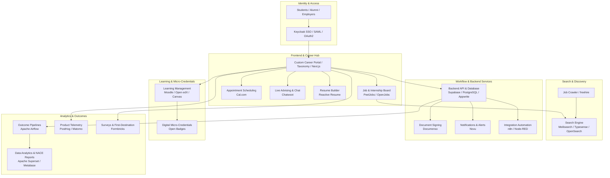

# 🎓 Awesome Career Services Platform 🚀

  

  
  
  
  
  
  
  

---

## 🌟 Overview & Ecosystem Architecture

A curated, comprehensive directory of **SaaS Career Services Platforms**, **Early-Career Recruiting Suites**, and **Open-Source Self-Hosted Architectures**. 

This repository serves higher-education leaders, career center directors, talent acquisition teams, EdTech developers, and student advisors seeking technology to streamline **student employability**, **experiential learning**, **on-campus recruiting (OCR)**, **career advising**, **internship matching**, and **NACE / First-Destination Outcomes Reporting**.

> 💡 **Looking for open-source building blocks?** Check out the [Open-Source GitHub Projects](#-open-source-github-projects) section for modular tools including ATS engines, scheduling infrastructure, resume builders, vector search, and analytical pipelines.

---

## 📑 Table of Contents

- [🏢 SaaS & Hosted Career Services Platforms](#-saas--hosted-career-services-platforms)
- [💻 Open-Source GitHub Projects](#-open-source-github-projects)
- [🏗️ Architectural Blueprints for Custom Career Portals](#️-architectural-blueprints-for-custom-career-portals)
- [🤝 How to Contribute](#-how-to-contribute)
- [📈 Star History](#-star-history)
- [⚖️ Disclaimer & Compliance](#️-disclaimer--compliance)

---

## 🏢 SaaS & Hosted Career Services Platforms

The table below is sorted in **descending order by company size** (Market Capitalization / Valuation / Annualized Revenue).

| Platform | Company Size (Valuation / Revenue) | Description & Core Capabilities | Pricing (Starting Tier) | Free Tier / Free Trial Limits |
| :--- | :--- | :--- | :--- | :--- |
| **[GradConnection](https://au.gradconnection.com/)** | **~$4.8B Market Cap** *(SEEK Ltd ASX: SEK, ~$1.2B Ann. Rev)* | Asia-Pacific and Australian graduate recruitment network connecting university students and grads with top employer internship programs. | **Employers:** Campus targeting from A$65/university; State job postings from A$120–$450; National campaigns starting at A$1,500 | **Students & Grads:** Free forever (unlimited graduate job search, application tracking, employer event invites) **Employers:** Free basic company profile setup |
| **[Handshake](https://joinhandshake.com/)** | **$3.5B Valuation** *(Est. Ann. Revenue: ~$150M–$200M core SaaS / ~$300M+ net AI run-rate)* | Three-sided higher-education career network connecting students, colleges, and employers for job/internship discovery, events, advising workflows, and outcomes tracking. | **Students:** Free **Employers:** Pro from $450/month ($4,500/year) **Universities:** Starting at ~$10,000/year | **Students:** Free forever (unlimited jobs, career fairs, advising appointments) **Employers:** Free Basic plan (unlimited job posts, company profile, 10 direct student messages/mo; 4-day Pro trial on 1st job post) |
| **[Forage](https://www.theforage.com/)** | **~$1.5B+ Parent EV** *(Acquired by EAB / Seramount)* | Virtual job-simulation platform offering free, open-access work experience programs authored by leading global employers to build practical career readiness. | **Students:** Free **Employers:** B2B simulation programs starting at ~$20,000–$50,000/year for bespoke course development | **Students & Learners:** Free forever (unlimited access to 300+ employer simulations, certificates, self-paced completion, direct recruiter discovery) **Employers:** Guided demonstration upon request |
| **[Symplicity](https://www.symplicity.com/)** | **~$150M–$200M Valuation** *(Est. Ann. Revenue: ~$25M–$35M)* | Comprehensive higher-ed student-lifecycle and campus software suite spanning career services, student conduct (Advocate), and accessibility services (Access). | **Institutions:** Multi-product institutional licenses starting at ~$25,000/year | **Students:** Free forever across licensed campus services **Administrators:** 30-day sandbox pilot for multi-department evaluation |
| **[Symplicity CSM](https://www.symplicity.com/career-services)** | **~$150M–$200M Valuation** *(Est. Ann. Revenue: ~$20M–$30M)* | Enterprise career-services management platform for higher-ed advising, employer relations, on-campus recruiting, experiential learning, and outcome analytics. | **Employers:** Symplicity Recruit starting at $329/month **Universities:** Annual licenses starting at ~£17,200/year (~$22,000/year for ≤1,000 FTE) | **Students:** Free forever via partner institution **Employers:** Free basic account to receive direct applicants from connected partner schools; 30-day institutional evaluation trial on request |
| **[JobTeaser](https://www.jobteaser.com/)** | **~$100M–$150M Valuation** *(Total Funding: $80M+, Est. Ann. Rev: ~$25M–$40M)* | European university career platform integrated directly into university portals for job/internship distribution, career guidance, and employer recruiting. | **Universities:** Free core Career Center platform **Employers:** Starter packs from €1,500/year (or ~€350 per individual job posting) | **Students & Universities:** Free forever (unlimited applications across Europe; free SaaS career center for schools) **Employers:** Free basic registration to post directly to select partner universities |
| **[RippleMatch](https://ripplematch.com/)** | **~$100M+ Valuation** *(Total Funding: $80M+, Series B Goldman Sachs lead)* | Early-career recruiting and AI talent-matching platform connecting students and recent graduates directly with enterprise recruiting teams. | **Students:** Free **Employers:** Starting at $2,500/month ($30,000/year up to $250,000/year) | **Students/Job Seekers:** Free forever (unlimited automated role matching, profile visibility, and applications) **Employers:** 14-day guided pilot upon sales consultation |
| **[PeopleGrove](https://www.peoplegrove.com/)** | **~$40M–$60M Valuation** *(Series A, Est. Ann. Revenue: ~$17.5M)* | Higher-education mentoring, career access, and alumni networking platform facilitating flash mentoring, career pathways, and student communities. | **Institutions:** Annual subscriptions starting at ~$10,000–$15,000/year for core mentoring/career modules | **Students & Alumni:** Free forever (unlimited mentor connections, alumni directory browsing, flash mentoring requests) **Institutions:** 14-day sandbox evaluation upon request |
| **[Firsthand](https://firsthand.co/)** | **~$30M–$50M Parent EV** *(Formerly Vault / Infobase Career Intelligence)* | Career exploration, employer research, company reviews, and career guidebooks with integrated student mentoring and webinar capabilities. | **Individuals:** Vault Gold at $14.99/month ($120/year) **Institutions:** Campus site licenses starting at ~$5,000/year | **Individuals:** Free basic tier (limited company overviews, top ranking snippets) + 7-day free trial of Vault Gold **Students:** Free unlimited access via subscribing institutional library/career center |
| **[VMock](https://www.vmock.com/)** | **~$25M–$40M Valuation** *(Est. Ann. Revenue: ~$10M–$15M)* | AI-powered career-readiness platform providing instant resume scoring, bullet-point analysis, LinkedIn profile optimization, and elevator pitch feedback. | **Institutions:** Annual contracts starting at ~$5,000–$15,000/year based on FTE enrollment **Individual Credits:** ~$15–$25 via partner programs | **Students:** Free access via subscribing universities (typically limited to 10 AI resume reviews/year and 3 video pitch evaluations) **Public Demo:** 1 free instant resume score assessment |
| **[Riipen](https://riipen.com/)** | **~$25M–$35M Valuation** *(Total Funding: $15M+, Est. Ann. Rev: ~$8M–$12M)* | Experiential-learning and project-based education marketplace connecting college classrooms and students with real-world corporate challenges. | **Employers:** Starter packages from $2,499/year (up to 10 projects/5 postings) **Institutions:** Annual licenses starting at ~$10,000/year | **Students:** Free forever (participate in courses, work on real projects, earn stipends) **Employers:** Free basic access for 1 matched project in select government-funded programs (e.g., Level UP) |
| **[12twenty](https://12twenty.com/)** | **~$20M–$30M Valuation** *(Bootstrapped / Private, Est. Ann. Rev: ~$8M–$12M)* | Career-center suite focused on student career development, OCR, internship tracking, employer engagement, and NACE/MBA CSEA outcome analytics. | **Starting at:** $10/user/month for small teams; Institutional packages starting at ~$5,000–$12,000/year based on modules | **Students:** Free forever via partner school (unlimited job searches & outcomes reporting) **Institutions:** 14-day evaluation demo sandbox |
| **[GradLeaders](https://www.gradleaders.com/)** | **~$15M–$25M Valuation** *(Private SaaS, Est. Ann. Revenue: ~$8M–$10M)* | Career-management and recruitment platform specialized in graduate, MBA, and undergraduate business career services and employer talent sourcing. | **Job Postings:** Starting at $250/post **Recruiters:** Candidate search access packages starting at ~$3,500/year | **Students:** Free forever (profile creation, resume upload, job applications) **Recruiters:** 14-day trial with preview access to select candidate databases |
| **[Suitable](https://www.suitable.co/)** | **~$15M–$25M Valuation** *(Growth Stage, Est. Ann. Revenue: ~$6M–$10M)* | Student-success and career-readiness platform mapping co-curricular competencies, high-impact activities, badges, and NACE readiness milestones. | **Institutions:** Annual subscriptions starting at ~$6,000/year based on student enrollment and modules | **Students:** Free forever via mobile/web apps (unlimited competency tracking, badging, digital portfolio export) **Institutions:** 14-day administrative pilot demo |
| **[Graduateland](https://graduateland.com/)** | **~$15M–$20M Valuation** *(JobTeaser Subsidiary, Est. Ann. Rev: ~$5M–$8M)* | European student and graduate career portal providing entry-level jobs, internships, graduate schemes, and virtual recruiting fairs. | **Employers:** Single job posting from €295/post; Recruitment subscriptions from €1,500/year | **Students & Graduates:** Free forever (unlimited job applications, profile creation, virtual career fairs) **Employers:** Free company profile creation and basic listing |
| **[NACElink](https://www.naceweb.org/)** | **~$10M–$14M Ann. Revenue** *(Non-Profit Professional Association)* | National Association of Colleges and Employers career network connecting university career centers directly with national employers and recruiters. | **Job Postings:** Starting at $220/30-day post (NACE members) / $275 (non-members); 90-day post at $660/$770 | **Students:** Free forever to search opportunities and submit resumes across participating college networks **Employers:** Free account registration (pay per individual active job post) |
| **[Big Interview](https://biginterview.com/)** | **~$10M–$15M Valuation** *(Private SaaS, Est. Ann. Revenue: ~$4M–$6M)* | AI and video-based interview training and preparation platform featuring mock interview practice, AI answer scoring, and structured video curricula. | **Job Seekers:** $39/month (1-month), $99 (3-month), or $299 lifetime **Institutions:** Starting at ~$3,500/year | **Students:** Free forever via participating college/university portals **Job Seekers:** 3-day free trial (includes access to 2 curriculum modules and 5 practice video interview recordings) |
| **[Parker Dewey](https://www.parkerdewey.com/)** | **~$8M–$12M Valuation** *(Seed / Growth, Est. Ann. Revenue: ~$3M–$5M)* | Micro-internship platform connecting college students and recent graduates with employers for short-term, paid professional assignments. | **Employers:** Fixed project fee (typically $200–$600 per project, 90% goes to student, 10% platform fee) **Parker Dewey Plus (Universities):** $5,000/year | **Students:** Free forever (no application fees, keep 100% of awarded student stipend) **Employers:** Free forever to create account and draft/post micro-internship projects |
| **[CareerShift](https://www.careershift.com/)** | **~$6M–$10M Valuation** *(Private SaaS, Est. Ann. Revenue: ~$3M–$5M)* | Targeted job-hunting, employer contact research, and networking tool aggregating nationwide job listings and verified recruiter contact details. | **Individuals:** Starting at ~$60/month (or invite-only CareerShift One) **Institutions:** Site licenses starting at ~$3,000–$5,000/year | **Students & Alumni:** Free forever via subscribing university/library portals **Individual Seekers:** 24-hour full-feature free trial |
| **[GoinGlobal](https://www.goinglobal.com/)** | **~$5M–$8M Valuation** *(Private EdTech, Est. Ann. Revenue: ~$2M–$4M)* | Global career and employment platform providing international job & internship search, country career guides, work permit guidance, and H-1B visa databases. | **Institutions:** Annual site subscriptions starting at ~$2,500–$4,500/year based on FTE enrollment | **Students & Alumni:** Free forever access via university library/career portal SSO **Institutions:** 30-day institutional trial for career centers and global programs |
| **[CareerEco](https://www.careereco.com/)** | **~$4M–$7M Valuation** *(Private SaaS, Est. Ann. Revenue: ~$2M–$3M)* | Virtual career fair and online recruiting event platform supporting multi-school fairs, chat rooms, video booths, and candidate screening. | **Registration:** Starting at $195–$495 per virtual fair/booth **Sponsorship Tiers:** $750–$1,000/event | **Students & Candidates:** Free forever (unlimited event registrations, chat/video booths, resume uploads) **Organizations:** Pay-per-event model (no recurring base subscription fee required) |

---

## 💻 Open-Source GitHub Projects

The open-source projects below are sorted in **descending order by GitHub star count**. Each badge links directly to that repository's stargazers page.

1. **[Supabase](https://github.com/supabase/supabase)**   
   Open-source Firebase alternative providing PostgreSQL, authentication, row-level security, instant APIs, storage, edge functions, and realtime subscriptions — ideal backend infrastructure for custom university career platforms.

2. **[Grafana](https://github.com/grafana/grafana)**   
   Open-source visualization and observability dashboard platform suitable for real-time career services operational KPIs, career fair attendance, and advisor appointment monitoring.

3. **[Apache Superset](https://github.com/apache/superset)**   
   Enterprise-grade business intelligence and data visualization platform for institutional career services dashboards, NACE First-Destination reporting, and student outcome analytics.

4. **[AppFlowy](https://github.com/AppFlowy-IO/AppFlowy)**   
   Open-source workspace and knowledge base alternative to Notion for student career portfolio building, advising notes, competency tracking, and institutional career guidebooks.

5. **[n8n](https://github.com/n8n-io/n8n)**   
   Fair-code workflow automation engine connecting career-services systems with campus SIS/LMS databases, CRM applications, calendar scheduling, email notifications, and webhook endpoints.

6. **[Meilisearch](https://github.com/meilisearch/meilisearch)**   
   Lightning-fast, typo-tolerant search engine optimized for ultra-responsive student queries across job postings, internships, alumni directories, mentor profiles, and campus recruiting events.

7. **[Appwrite](https://github.com/appwrite/appwrite)**   
   Open-source backend-as-a-service platform providing authentication, document databases, file storage, serverless functions, and SDKs for building student-facing web and mobile career apps.

8. **[Metabase](https://github.com/metabase/metabase)**   
   Intuitive business intelligence and reporting tool enabling career center directors and advisors to create self-service visual reports on student engagement, employer activity, and hiring salaries.

9. **[Apache Airflow](https://github.com/apache/airflow)**   
   Programmatic workflow orchestration platform for automating batch data pipelines, external labor market data scraping, alumni outcome ETL, and student information system synchronizations.

10. **[Novu](https://github.com/novuhq/novu)**   
    Open-source notification infrastructure enabling unified multi-channel messaging (email, SMS, mobile push, in-app bell) for new job match alerts, interview reminders, and career fair updates.

11. **[Cal.com](https://github.com/calcom/cal.com)**   
    Open-source appointment scheduling infrastructure for booking career advising sessions, 1-on-1 counselor meetings, employer on-campus interviews, and resume critique appointments.

12. **[PostHog](https://github.com/PostHog/posthog)**   
    All-in-one product analytics, session recording, and feature-flagging platform to measure student journeys, application drop-off funnels, and feature usage on university career portals.

13. **[Keycloak](https://github.com/keycloak/keycloak)**   
    Enterprise open-source identity and access management system supporting OAuth2, SAML 2.0, OpenID Connect, campus SSO, student identity federation, and granular role-based permissions.

14. **[Reactive Resume](https://github.com/AmruthPillai/Reactive-Resume)**   
    Free and open-source resume builder with real-time editing, ATS-friendly templates, multi-language support, custom URL sharing, and pixel-perfect PDF rendering.

15. **[Chatwoot](https://github.com/chatwoot/chatwoot)**   
    Open-source customer engagement and live chat suite for university career center help desks, virtual career fair live inquiries, student triage, and counselor messaging.

16. **[Typesense](https://github.com/typesense/typesense)**   
    Fast, typo-tolerant search engine providing instant faceted filtering for job titles, internship locations, required skill keywords, and employer industries.

17. **[Matomo](https://github.com/matomo-org/matomo)**   
    Privacy-first, self-hosted web analytics platform ensuring FERPA/GDPR compliance when tracking career resource engagement, job board views, and event traffic.

18. **[Node-RED](https://github.com/node-red/node-red)**   
    Low-code flow-based visual programming tool for connecting career-service REST APIs, hardware event check-in kiosks, and real-time messaging channels.

19. **[Taxonomy](https://github.com/shadcn-ui/taxonomy)**   
    Open-source modern web application built with Next.js App Router, Tailwind CSS, and shadcn/ui — serving as a reference architecture for building performant student career portals.

20. **[Formbricks](https://github.com/formbricks/formbricks)**   
    Open-source survey and experience management suite for collecting First-Destination Surveys, post-advising student ratings, and employer feedback.

21. **[Documenso](https://github.com/documenso/documenso)**   
    Open-source digital document signing platform for executing internship agreements, experiential learning contracts, employer NDAs, and student offer letters.

22. **[OpenSearch](https://github.com/opensearch-project/OpenSearch)**   
    Scalable search and analytics suite suitable for vector search, keyword matching, and log analytics across large campus job boards and talent repositories.

23. **[Canvas LMS](https://github.com/instructure/canvas-lms)**   
    Open-source learning management system providing course structures, grading, and assignments for career readiness curricula and co-curricular programs.

24. **[Open edX](https://github.com/openedx/edx-platform)**   
    Scalable online learning platform powering professional certification, workforce upskilling, and institutional career education courses.

25. **[Frappe HR](https://github.com/frappe/hrms)**   
    Open-source HR and recruitment engine providing job postings, applicant tracking, interview management, candidate onboarding, and staff workflows.

26. **[Moodle](https://github.com/moodle/moodle)**   
    Modular open-source learning management system for hosting career development courses, resume workshops, and badged competency pathways.

27. **[WP Job Manager](https://github.com/Automattic/WP-Job-Manager)**   
    Lightweight, shortcode-based job board plugin for WordPress to publish university career opportunities, internships, and employer profiles.

28. **[OpenCATS](https://github.com/opencats/OpenCATS)**   
    Open-source applicant tracking system for managing candidate pipelines, resume parsing, job orders, and recruiting workflows.

29. **[Career Pilot](https://github.com/anurag3407/career-pilot)**   
    Open-source AI-powered career operating system combining resume parsing, mock interviews, job tracking, portfolio building, and outreach tools.

30. **[PeelJobs / Open Source Job Portal](https://github.com/MicroPyramid/opensource-job-portal)**   
    Python/Django open job portal featuring recruiter profiles, candidate resume management, job application tracking, and automated email alerts.

31. **[freehire](https://github.com/strelov1/freehire)**   
    Automated job-search engine that crawls corporate career sites, extracts structured job postings, deduplicates opportunities, and indexes them for discovery.

32. **[Open Badges Specification](https://github.com/mozilla/openbadges-specification)**   
    Standard specification for verifiable digital credentials, micro-credentials, and skill badges to represent career readiness milestones.

33. **[JobSync](https://github.com/Gsync/jobsync)**   
    Self-hosted, AI-assisted job application tracker with automated job discovery, resume matching, analytics, task scheduling, and MCP integration.

34. **[OpenAlex](https://github.com/ourresearch/openalex-guts)**   
    Open index of global research papers, authors, and institutions for academic career pathing, faculty researcher matching, and institutional enrichment.

35. **[OpenJobs](https://github.com/hamishfromatech/open-jobs)**   
    Modern open-source job-board application designed to connect job seekers with hiring companies, featuring candidate profiles and job alerts.

36. **[JobHunt](https://github.com/BaseMax/JobHuntTS)**   
    TypeScript and GraphQL job-board platform with employer job posting, candidate profiles, application tracking, and extensible schema.

37. **[OpenSkills / Open Syllabus](https://github.com/opensyllabus/opensyllabus)**   
    Curriculum mapping and syllabus analytics platform connecting higher-education course content with workforce skills and career competencies.

---

## 🏗️ Architectural Blueprints for Custom Career Portals

Because enterprise career services software spans diverse domains (authentication, applicant tracking, advising calendars, outcomes surveys, and learning), institutions can compose a tailored, sovereign platform using best-of-breed open-source blocks:

---

## 🤝 How to Contribute

Contributions are welcome and highly appreciated! To contribute to this ecosystem list:

1. 🍴 **Fork the repository**.
2. 🌿 **Create a new branch**: `git checkout -b add-my-career-tool`.
3. 📝 **Add your project**:
   - For **SaaS platforms**: Add to the table with company size, specific starting tier pricing, and free tier/trial limits.
   - For **Open-Source projects**: Include the name, official link, stargazer social badge (``), and place it in the correct star-count order.
4. 🧪 **Ensure links and formatting are valid**.
5. 🚀 **Submit a Pull Request** with a brief summary of the project and why it belongs here.

---

## 📈 Star History

---

## ⚖️ Disclaimer & Compliance

- This repository is a **community-curated index** for informational, architectural, and educational purposes — not a commercial endorsement.
- Enterprise university career platforms differ substantially in scale, security certifications, accessibility compliance (WCAG/Section 508), and FERPA/GDPR compliance.
- When deploying open-source components, ensure proper evaluation of data privacy, institutional SSO integration, data encryption, and production readiness.
- Product logos, trademarks, and service names are the property of their respective owners.

---

  <b>Built for Higher-Ed Career Centers, Workforce Innovators, Students, and Open-Source Technologists.</b> 
  ⭐ <i>If you find this repository valuable, please consider starring it on GitHub!</i>

